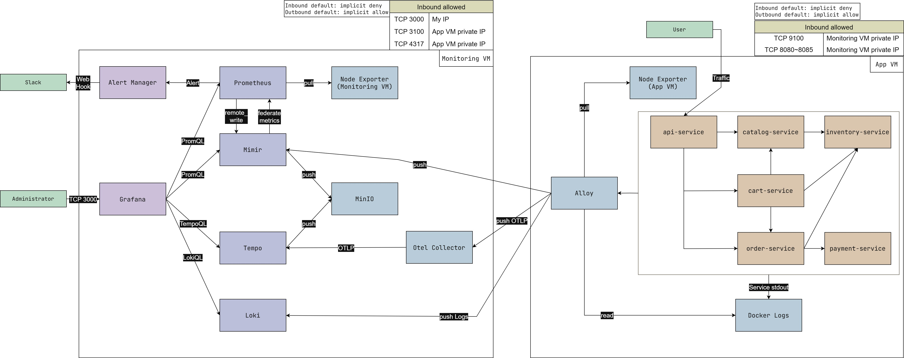

# LGTM Observability Stack

소규모 MSA 스타일 데모 워크로드를 관측하기 위한 2-VM 기반 LGTM observability stack



## Data Flow

- Logs: App VM Docker logs -> Promtail -> Loki -> Grafana 순서로 전달
- Metrics: Prometheus가 App VM 서비스와 Node Exporter를 pull하고 Mimir에 저장한 뒤 Grafana에서 조회
- Traces: MSA 서비스가 OTLP gRPC로 OTel Collector에 trace를 보내고, Collector가 Tempo로 전달
- Storage: Mimir와 Tempo는 block 데이터를 MinIO에 저장

## Demo Request Flows

```text
/browse
  api-service -> catalog-service -> inventory-service

/cart/add
  api-service -> cart-service -> catalog-service
                              -> inventory-service

/checkout
  api-service -> cart-service
              -> order-service -> inventory-service
                               -> payment-service
```

## Deployment

Monitoring VM:

```bash
cp .env.monitoring.example .env
# edit APP_VM_PRIVATE_IP, GRAFANA_ADMIN_PASSWORD, MINIO_ROOT_PASSWORD
docker compose up -d
docker compose ps
```

App VM:

```bash
cp .env.app.example .env
# edit MONITORING_VM_PRIVATE_IP and APP_HOST_LABEL
docker compose up -d --build
docker compose ps
```

설치 절차, 보안그룹 규칙, 검증 단계는 `docs/two-vm-deployment.md`를 참고

## Key Services

| VM | Service | Port | Purpose |
| --- | --- | ---: | --- |
| Monitoring | Grafana | 3000 | 외부 Web UI |
| Monitoring | Loki | 3100 | 로그 수집 및 조회 |
| Monitoring | Mimir | 9009 | 메트릭 저장 및 조회 |
| Monitoring | Tempo | 3200 | 트레이스 조회 |
| Monitoring | OTel Collector | 4317, 4318 | 트레이스 수집 |
| Monitoring | Prometheus | 9090 | 메트릭 scrape 및 remote write |
| Monitoring | MinIO | 9000, 9001 | 오브젝트 스토리지 |
| App | api-service | 8080 | 데모 서비스 진입점 |
| App | catalog-service | 8081 | 상품 카탈로그 |
| App | inventory-service | 8082 | 재고 조회 및 예약 |
| App | cart-service | 8083 | 장바구니 처리 |
| App | order-service | 8084 | 주문 처리 |
| App | payment-service | 8085 | 결제 승인 |
| App | Node Exporter | 9100 | App VM 시스템 메트릭 |

## Security Group Inbound Allowed

Monitoring VM inbound:

| Port | Source | Purpose |
| ---: | --- | --- |
| 22/tcp | Your IP | SSH 접속 |
| 3000/tcp | Your IP | Grafana Web UI |
| 3100/tcp | App VM private IP | Promtail -> Loki 로그 전송 |
| 4317/tcp | App VM private IP | MSA services -> OTel Collector OTLP gRPC |

App VM inbound:

| Port | Source | Purpose |
| ---: | --- | --- |
| 22/tcp | Your IP | SSH 접속 |
| 8080/tcp | Monitoring VM private IP | API Service 메트릭 scrape |
| 8081/tcp | Monitoring VM private IP | Catalog Service 메트릭 scrape |
| 8082/tcp | Monitoring VM private IP | Inventory Service 메트릭 scrape |
| 8083/tcp | Monitoring VM private IP | Cart Service 메트릭 scrape |
| 8084/tcp | Monitoring VM private IP | Order Service 메트릭 scrape |
| 8085/tcp | Monitoring VM private IP | Payment Service 메트릭 scrape |
| 9100/tcp | Monitoring VM private IP | Node Exporter 메트릭 scrape |

## Generate Traffic

(1) App VM에서 짧게 수동 테스트할 때 사용

```bash
curl http://localhost:8080/browse
curl http://localhost:8080/cart/add
curl http://localhost:8080/checkout
curl http://localhost:8080/error
```

(2) 여러 날 동안 관찰할 트래픽을 만들 때 사용

```bash
chmod +x ./scripts/random-demo-traffic.sh
mkdir -p ./logs
./scripts/random-demo-traffic.sh
```

Cron example:

```cron
* * * * * cd /home/ubuntu/lgtm-observability-stack && DEMO_APP_URL=http://localhost:8080 ./scripts/random-demo-traffic.sh >> /home/ubuntu/lgtm-observability-stack/logs/random-demo-traffic.log 2>&1
```

## Useful Queries

PromQL:

```promql
up
sum by (service) (rate(demo_app_requests_total[5m]))
histogram_quantile(0.95, sum by (le, service) (rate(demo_app_request_duration_seconds_bucket[5m])))
```

LogQL:

```logql
{job="docker", host="app-vm"}
{job="docker", host="app-vm"} |= "payment authorization failed"
```

TraceQL:

```traceql
{ resource.service.name = "api-service" }
{ resource.service.name = "api-service" || resource.service.name = "cart-service" || resource.service.name = "order-service" }
```

## Key Files

| Path | Description |
| --- | --- |
| `docker-compose.monitoring.yml` | Monitoring VM 실행 정의 |
| `docker-compose.app.yml` | App VM 실행 정의 |
| `.env.monitoring.example` | Monitoring VM용 환경변수 템플릿 |
| `.env.app.example` | App VM용 환경변수 템플릿 |
| `configs/prometheus/prometheus.two-vm.yml` | 두 VM을 scrape하는 Prometheus 설정 |
| `configs/promtail/promtail-app-config.yaml` | App VM Promtail 설정 |
| `msa-demo` | 6개 MSA 데모 서비스가 공유하는 이미지 소스 |
| `scripts/random-demo-traffic.sh` | 장기 관찰용 랜덤 트래픽 생성 스크립트 |
| `scripts/fault-injection.sh` | alert 테스트용 장애 주입 및 복구 스크립트 |

## Documentation

- `docs/architecture.md` # LGTM observability stack 아키텍처
- `docs/two-vm-deployment.md` # 두 VM 배포 및 검증
- `docs/validation.md` # Prometheus, Grafana, Loki, Tempo, Mimir 검증
- `docs/alert-scenarios.md` # alert 시나리오 및 검증
- `docs/troubleshooting.md` # 문제 해결
- `docs/version-policy.md` # 버전 정책
