# LGTM Observability Stack 구축 및 Alloy 기반 통합 수집 구조 고도화 결과보고서

## 1. 프로젝트 개요

### 1.1 프로젝트 목적

본 프로젝트의 목적은 Cloud VM 환경에서 로그, 메트릭, 트레이스를 수집하고 Grafana에서 통합적으로 조회할 수 있는 LGTM Observability Stack을 직접 구축하는 것이다. 구체적으로는 Loki, Grafana, Mimir, Tempo를 중심으로 로그·메트릭·트레이스 수집 파이프라인을 구성하고, MinIO를 활용해 데이터를 저장하며, Alertmanager 기반 Slack 알림까지 연동하여 통합 모니터링 환경을 완성하는 것이다.

### 1.2 수행 범위 및 수행 기간

본 프로젝트는 2주간 단독 수행으로 진행되었다. 주요 수행 범위는 다음과 같다.

- Docker Compose 기반 Monitoring Stack 구축
- K3S 기반 MSA Demo App 배포
- Loki 기반 로그 수집 및 LogQL 조회
- Mimir 기반 메트릭 저장 및 PromQL 조회
- Tempo 기반 trace 저장 및 TraceQL 조회
- Grafana dashboard 구성 및 JSON export
- Prometheus/Mimir alert rule 구성
- Alertmanager Slack 알림 연동
- 장애 주입 및 복구 시나리오 검증
- README, 검증 문서, 버전 정책, 결과보고서 작성

## 2. 전체 시스템 아키텍처

### 2.1 2-VM 구성 개요

본 프로젝트는 Monitoring VM과 App VM으로 역할을 분리한 2-VM 구조로 구성하였다. Monitoring VM은 관측 데이터를 저장하고 시각화하는 backend stack을 담당하고, App VM은 K3S 위에서 MSA 데모 애플리케이션과 telemetry 수집 에이전트를 실행한다.

이 구조를 선택한 이유는 실제 운영 환경에서 관측 시스템과 애플리케이션 실행 환경이 분리되는 경우가 많기 때문이다.

#### 2.1.1 Monitoring VM 설명

Monitoring VM은 Docker Compose 기반으로 Grafana, Loki, Mimir, Tempo, Prometheus, Alertmanager, OpenTelemetry Collector, MinIO, Node Exporter를 실행한다.

Monitoring VM의 주요 역할은 다음과 같다.

- Grafana를 통한 대시보드 및 Explore UI 제공
- Loki를 통한 App VM K3S Pod 로그 저장 및 조회
- Mimir를 통한 App/Monitoring VM 메트릭 저장 및 조회
- Tempo를 통한 MSA trace 저장 및 조회
- Prometheus를 통한 Monitoring backend 컴포넌트 scrape 및 backend alert 평가
- Alertmanager를 통한 Slack 알림 전송
- MinIO를 통한 Mimir/Tempo object storage 제공
- OTel Collector를 통한 Alloy trace 수신 및 Tempo 전달

#### 2.1.2 App VM 설명

App VM은 단일 노드 K3S 환경으로 구성하였다. K3S 위에는 MSA Demo App, Alloy, Node Exporter가 배포된다.

MSA Demo App은 하나의 Flask 애플리케이션 이미지를 여러 Deployment에서 환경변수로 역할을 바꾸어 실행하는 방식이다. 서비스는 `api-service`, `catalog-service`, `inventory-service`, `cart-service`, `order-service`, `payment-service`로 구성된다. `api-service`는 외부 요청의 진입점 역할을 하며, `/browse`, `/cart/add`, `/checkout`, `/work` endpoint를 제공한다.

App VM의 주요 역할은 다음과 같다.

- K3S 기반 MSA 데모 서비스 실행
- Node Exporter를 통한 App VM 시스템 메트릭 노출
- Alloy를 통한 로그, 메트릭, 트레이스 통합 수집
- Monitoring VM의 Loki, Mimir, OTel Collector로 telemetry 전송

### 2.2 아키텍처 1: Promtail 기반 초기 구조

- 아키텍처 1 GitHub 링크: [lgtm-observability-stack-origin](https://github.com/Edrient17/lgtm-observability-stack-origin.git)

#### 2.2.1 아키텍처 다이어그램

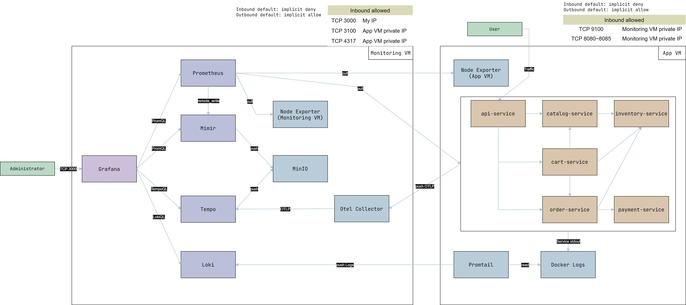

초기 구조는 App VM의 로그 수집에는 Promtail을 사용하고, 메트릭 수집에는 Monitoring VM의 Prometheus가 App VM의 서비스 endpoint를 직접 scrape하는 방식이었다. Trace는 MSA 서비스가 Monitoring VM의 OTel Collector로 직접 전송하고, Collector가 Tempo로 전달하였다.

#### 2.2.2 주요 컴포넌트

Promtail 기반 초기 구조의 Monitoring VM 구성 요소는 다음과 같다.

| 컴포넌트 | 역할 |
| --- | --- |
| Grafana | 로그, 메트릭, 트레이스 대시보드 및 Explore UI |
| Loki | Promtail이 전송한 K3S Pod 로그 저장 |
| Mimir | Prometheus remote_write로 전달된 메트릭 저장 |
| Tempo | MSA trace 저장 및 조회 |
| Prometheus | Monitoring VM 및 App VM target scrape |
| Alertmanager | Prometheus alert 수신 및 Slack 전송 |
| MinIO | Mimir, Tempo block 저장 |
| OTel Collector | MSA 서비스가 전송한 trace를 Tempo로 전달 |

App VM 구성 요소는 다음과 같다.

| 컴포넌트 | 역할 |
| --- | --- |
| MSA Demo App | K3S 기반 6개 서비스 데모 애플리케이션 |
| Promtail | K3S Pod 로그 파일 수집 후 Loki로 push |
| Node Exporter | App VM 시스템 메트릭 노출 |

#### 2.2.3 데이터 흐름

초기 구조의 로그 흐름은 다음과 같다.

```text
K3S Pod stdout/stderr
-> /var/log/containers/*.log
-> Promtail
-> Loki
-> Grafana
```

메트릭 흐름은 다음과 같다.

```text
App VM service /metrics, Node Exporter /metrics
-> Monitoring VM Prometheus scrape
-> Mimir remote_write
-> Grafana
```

트레이스 흐름은 다음과 같다.

```text
MSA service
-> OTLP gRPC
-> Monitoring VM OTel Collector
-> Tempo
-> Grafana
```

#### 2.2.4 주요 포트 및 네트워크 정책

초기 구조에서는 Monitoring VM이 App VM의 서비스 endpoint를 직접 scrape해야 했기 때문에 App VM inbound에 여러 service port를 열어야 했다.

| VM | Port | Source | 용도 |
| --- | ---: | --- | --- |
| Monitoring VM | 3000 | 관리자 IP | Grafana Web UI |
| Monitoring VM | 3100 | App VM private IP | Promtail -> Loki 로그 전송 |
| Monitoring VM | 4317 | App VM private IP | MSA service -> OTel Collector trace 전송 |
| App VM | 8080~8085 | Monitoring VM private IP | MSA service metric scrape |
| App VM | 9100 | Monitoring VM private IP | Node Exporter metric scrape |

### 2.3 Promtail 기반 구조의 한계

Promtail 기반 초기 구조는 로그 수집 관점에서는 요구사항을 충족할 수 있지만, 다음과 같은 한계점이 있다.

첫 번째 한계는 App VM의 inbound 정책이 복잡해진다는 점이다. Prometheus가 Monitoring VM에서 App VM의 MSA service와 Node Exporter를 직접 scrape하기 때문에 App VM은 `8080~8085`, `9100` 포트를 Monitoring VM에 열어야 했다. 실습 환경에서는 관리 가능하지만, 관측 대상 서비스가 늘어날수록 보안그룹과 scrape target 관리가 복잡해진다.

두 번째 한계는 telemetry 수집 책임이 분산된다는 점이다. 로그는 Promtail, 메트릭은 Prometheus, 트레이스는 애플리케이션에서 OTel Collector로 직접 전송하는 방식이어서 수집 경로를 한 곳에서 관리하기 어렵다. 장애가 발생했을 때도 로그 경로, 메트릭 경로, 트레이스 경로를 각각 따로 점검해야 한다.

세 번째 한계는 Prometheus scrape target 관리 부담과 scrape 부하가 증가한다는 점이다. 특히 MSA 서비스가 많아지면 scrape target이 늘어나고, Prometheus의 scrape 주기와 데이터 처리량이 증가하여 Monitoring VM의 리소스 사용량이 높아진다.

위의 한계점들을 개선하기 위해, Promtail 기반 초기 구조에서 Alloy 기반 최종 구조로 아키텍처를 변경하였다. Alloy는 로그, 메트릭, 트레이스를 통합 수집할 수 있는 솔루션으로, App VM에서 Alloy가 telemetry agent 역할을 수행하도록 하였다. Alloy를 도입함으로써 App VM의 inbound 정책을 단순화하고, 수집 경로를 통합하며, Monitoring VM의 부하를 분산시킬 수 있었다.

### 2.4 아키텍처 2: Alloy 기반 최종 구조

#### 2.4.1 아키텍처 다이어그램

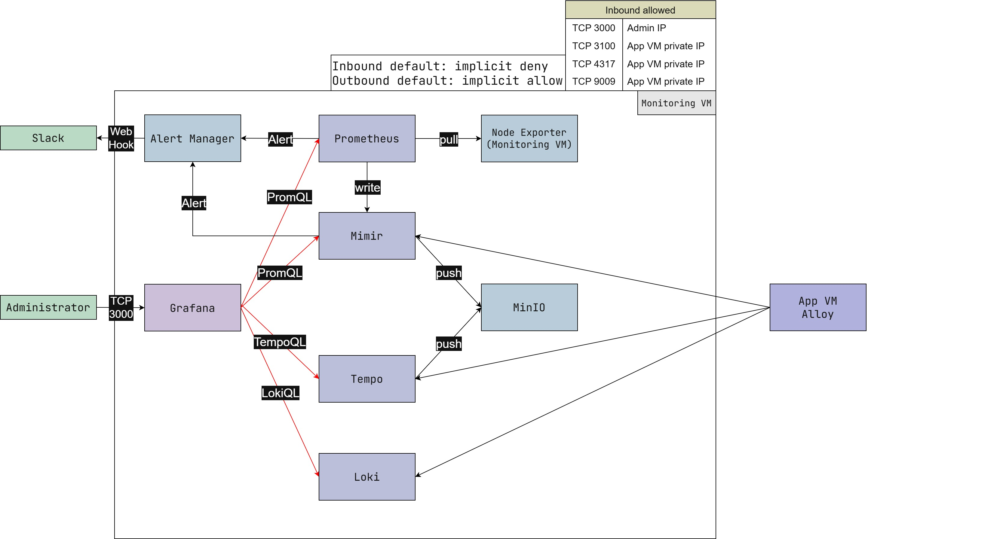

Alloy 기반 최종 구조에서는 App VM의 Alloy가 로그, 메트릭, 트레이스 수집을 통합한다. Alloy는 K3S Pod 로그 파일을 읽어 Loki로 전송하고, MSA service와 Node Exporter의 `/metrics` endpoint를 scrape한 뒤 Mimir로 remote_write한다. 또한 MSA 서비스가 전송하는 OTLP trace를 수신하여 Monitoring VM의 OTel Collector로 전달한다.

#### 2.4.2 주요 컴포넌트

최종 구조의 Monitoring VM 구성 요소는 다음과 같다.

| 컴포넌트 | 역할 |
| --- | --- |
| Grafana | LGTM 통합 대시보드 및 Explore Web UI |
| Loki | App VM K3S Pod 로그 저장 및 LogQL 조회 |
| Mimir | App/Monitoring VM 메트릭 저장 및 PromQL 조회 |
| Tempo | MSA trace 저장 및 TraceQL 조회 |
| Prometheus | Monitoring VM backend 메트릭 scrape 및 backend alert 평가 |
| Alertmanager | Prometheus와 Mimir Ruler alert를 Slack으로 전송 |
| OTel Collector | App VM Alloy가 보낸 trace를 Tempo로 전달 |
| MinIO | Mimir, Tempo block 저장용 S3 호환 object storage |
| Node Exporter | Monitoring VM 시스템 메트릭 노출 |

최종 구조의 App VM 구성 요소는 다음과 같다.

| 컴포넌트 | 역할 |
| --- | --- |
| api-service | 외부 요청 진입점, `/browse`, `/cart/add`, `/checkout`, `/work` 제공 |
| catalog-service | 상품 카탈로그 조회 |
| inventory-service | 재고 조회 및 예약 |
| cart-service | 장바구니 처리 |
| order-service | 주문 생성 처리 |
| payment-service | 결제 승인 처리 |
| Alloy | 로그, 메트릭, 트레이스 통합 수집 및 Monitoring VM 전달 |
| Node Exporter | App VM 시스템 메트릭 노출 |

#### 2.4.3 데이터 흐름

최종 구조의 로그 흐름은 다음과 같다.

```text
K3S Pod stdout/stderr
-> /var/log/containers/*.log
-> Alloy loki.source.file
-> Alloy loki.process
-> Loki
-> Grafana
```

로그는 JSON formatter를 통해 `service`, `role`, `level`, `logger`, `message`, `trace_id`, `span_id` 필드를 포함한다. Alloy는 CRI stage와 JSON stage를 통해 로그를 파싱하고, `service`, `level`, `logger`를 label로, `trace_id`, `span_id`를 structured metadata로 전달한다.

메트릭 흐름은 다음과 같다.

```text
MSA service /metrics, App VM Node Exporter /metrics
-> Alloy prometheus.scrape
-> Alloy prometheus.remote_write
-> Mimir /api/v1/push
-> Grafana
```

Monitoring VM backend 메트릭은 Prometheus가 scrape하고, 동일하게 Mimir로 remote_write한다. 단, App VM MSA metric은 Alloy가 담당하므로 Monitoring VM Prometheus에서는 App VM scrape target을 직접 관리하지 않는다.

트레이스 흐름은 다음과 같다.

```text
MSA service
-> OTLP gRPC
-> Alloy otelcol.receiver.otlp
-> Monitoring VM OTel Collector
-> Tempo
-> Grafana
```

MSA Demo App은 OpenTelemetry Flask/Requests instrumentation을 사용하여 HTTP request와 downstream call trace를 생성한다. `/browse` 요청은 `api-service -> catalog-service -> inventory-service` 흐름을 만들고, `/checkout` 요청은 `api-service -> cart-service/order-service -> inventory-service/payment-service` 흐름을 만든다.

#### 2.4.4 주요 포트 및 네트워크 정책

최종 구조에서는 App VM의 service port를 외부에 공개하지 않고, App VM에서 Monitoring VM으로 telemetry를 전송하는 구조로 정리하였다.

Monitoring VM inbound 정책은 다음과 같다.

| Port | Source | 용도 |
| ---: | --- | --- |
| 22/tcp | 관리자 IP | SSH 접속 |
| 3000/tcp | 관리자 IP | Grafana Web UI |
| 3100/tcp | App VM private IP | Alloy -> Loki 로그 전송 |
| 4317/tcp | App VM private IP | Alloy -> OTel Collector OTLP gRPC trace 전송 |
| 9009/tcp | App VM private IP | Alloy -> Mimir remote_write |

App VM inbound 정책은 다음과 같다.

| Port | Source | 용도 |
| ---: | --- | --- |
| 22/tcp | 관리자 IP | SSH 접속 |

App VM 내부의 `8080~8085`, `9100`, `4317` 포트는 K3S 내부 통신 또는 VM 내부 검증에 사용하며 외부에 공개하지 않는다. 이 변경으로 관측 대상 서비스가 늘어나도 Monitoring VM 보안그룹에 필요한 수신 포트 중심으로 관리할 수 있게 되었다.

### 2.5 아키텍처 변경의 장점

Promtail 기반 초기 구조에서 Alloy 기반 최종 구조로 변경하면서 가장 크게 개선된 부분은 관측 대상 확장 방식이다. 초기 구조에서는 새로운 App VM이나 서비스가 추가될 때마다 Monitoring VM의 Prometheus scrape target을 수정하고, App VM 쪽의 서비스 포트를 Monitoring VM에 허용해야 했다. 반면 Alloy 기반 구조에서는 관측 대상 VM 또는 노드에 Alloy agent를 배치하고, 해당 agent가 로컬에서 로그와 메트릭을 수집한 뒤 Monitoring VM의 Loki, Mimir, OTel Collector로 전달한다. 이 방식은 관측 대상이 늘어날수록 Monitoring VM의 설정이 비대해지는 문제를 줄이고, 각 App VM이 자신의 telemetry 수집 책임을 일부 분담하도록 만든다.

네트워크 정책도 단순해졌다. Prometheus가 App VM의 `8080~8085`, `9100` 포트를 직접 scrape하던 구조에서는 App VM inbound에 여러 서비스 포트를 열어야 했다. 최종 구조에서는 App VM 내부의 서비스 포트는 외부에 공개하지 않고, Alloy가 App VM 내부에서 metric을 scrape한 뒤 Mimir로 remote_write한다. 따라서 Monitoring VM은 Loki `3100`, Mimir `9009`, OTel Collector `4317`처럼 telemetry를 수신하는 포트 중심으로 관리하면 된다. 이는 보안그룹을 더 단순하게 만들고, 애플리케이션 서비스 포트가 외부 네트워크에 노출되는 범위를 줄이는 장점이 있다.

운영 관점에서도 Alloy 기반 구조가 더 일관적이다. 초기 구조에서는 로그는 Promtail, 메트릭은 Prometheus scrape, 트레이스는 애플리케이션의 OTLP exporter가 각각 다른 경로로 동작했다. 최종 구조에서는 App VM의 Alloy가 로그 수집, 메트릭 scrape 및 remote_write, trace relay를 함께 담당한다. 장애가 발생했을 때도 App VM의 telemetry agent 상태와 Monitoring VM backend 수신 상태를 중심으로 점검할 수 있어 문제 분석 경로가 더 명확해진다.

결과적으로 Alloy 기반 구조는 요구사항서의 기본 기능을 유지하면서도, 확장성, 보안성, 운영 편의성을 개선한 최종 아키텍처라고 볼 수 있다.

## 3. 구축 과정

### 3.1 Docker Compose 기반 Monitoring Stack 구축

Monitoring VM에서는 프로젝트 루트의 `docker-compose.yml`을 사용하여 전체 backend stack을 실행하였다. `.env.example`을 복사하여 `.env`를 만들고, Grafana 관리자 계정, MinIO 계정, Slack webhook URL을 설정하였다.

```bash
cp .env.example .env
docker compose up -d
docker compose ps
```

Docker Compose stack에는 Grafana, Loki, Mimir, Tempo, Prometheus, Alertmanager, OTel Collector, MinIO, Node Exporter가 포함된다. Mimir와 Tempo는 block storage로 MinIO를 사용하며, `minio-init` 컨테이너가 필요한 bucket을 초기 생성한다. `mimir-rules-init` 컨테이너는 App/MSA alert rule을 Mimir Ruler API에 등록한다.

### 3.2 K3S 기반 MSA Demo App 배포

App VM에는 단일 노드 K3S를 설치하고, `k3s/app-vm` 디렉터리의 Kustomize manifest를 적용하였다. 배포 전 `configmap.example.yaml`을 `configmap.yaml`로 복사한 뒤 Monitoring VM private IP를 설정하였다.

```bash
cp k3s/app-vm/configmap.example.yaml k3s/app-vm/configmap.yaml
./scripts/k3s-load-demo-image.sh
kubectl apply -k ./k3s/app-vm
kubectl -n msa-demo get pods,svc,daemonset
```

K3S에는 `api-service`, `catalog-service`, `inventory-service`, `cart-service`, `order-service`, `payment-service`, `alloy`, `node-exporter`가 배포된다. `msa-demo` 이미지는 App VM에서 직접 빌드한 뒤 K3S containerd로 import하는 방식으로 사용하였다.

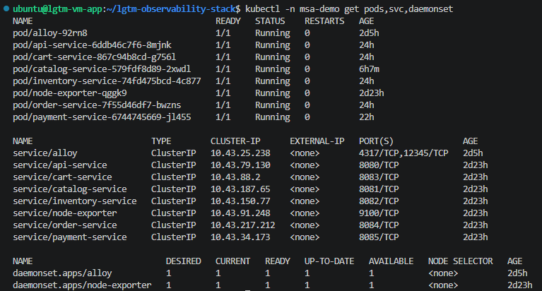

### 3.3 Loki 로그 파이프라인 구성

로그 파이프라인은 App VM의 Alloy가 K3S Pod 로그 파일을 읽어 Loki로 전송하는 방식으로 구성하였다. Alloy는 `/var/log/containers/*_msa-demo_*.log` 경로를 대상으로 파일 수집을 수행한다.

애플리케이션 로그는 JSON 형식으로 출력되며, 로그에는 `service`, `role`, `level`, `logger`, `message`, `trace_id`, `span_id`가 포함된다. Alloy의 `loki.process` 단계에서는 CRI 로그를 파싱한 뒤 JSON 필드를 추출하고, 서비스명과 로그 레벨을 label로 지정한다. `trace_id`와 `span_id`는 structured metadata로 전달되어 Loki 로그와 Tempo trace를 연결하는 데 사용된다.

Grafana Loki datasource에는 derived field가 설정되어 있어 로그에 포함된 `trace_id`를 기반으로 Tempo trace로 이동할 수 있다.

### 3.4 Mimir 메트릭 파이프라인 구성

메트릭 파이프라인은 App VM metric과 Monitoring VM backend metric을 구분하여 구성하였다.

App VM의 MSA 서비스와 Node Exporter metric은 Alloy가 scrape한다. Alloy는 `api-service:8080`, `catalog-service:8081`, `inventory-service:8082`, `cart-service:8083`, `order-service:8084`, `payment-service:8085`, `node-exporter:9100`을 대상으로 scrape를 수행하고, 수집한 metric을 Mimir의 `/api/v1/push` endpoint로 remote_write한다.

Monitoring VM backend metric은 Prometheus가 scrape한다. Prometheus는 Grafana, Loki, Mimir, Tempo, Alertmanager, Monitoring VM Node Exporter를 대상으로 scrape를 수행하고, 수집한 metric을 Mimir로 remote_write한다.

Grafana에서는 Mimir datasource를 Prometheus type으로 등록하고, URL은 `http://mimir:9009/prometheus`를 사용하였다.

### 3.5 Tempo 트레이스 파이프라인 구성

MSA Demo App은 OpenTelemetry Flask instrumentation과 Requests instrumentation을 사용하여 trace를 생성한다. 각 서비스는 `OTEL_SERVICE_NAME`과 `SERVICE_ROLE` 환경변수에 따라 trace resource attribute를 설정한다.

App VM 내부에서는 MSA 서비스가 Alloy의 OTLP gRPC endpoint로 trace를 전송한다. Alloy는 trace를 batch 처리한 뒤 Monitoring VM의 OTel Collector로 전달하고, OTel Collector는 Tempo로 export한다.

Grafana Tempo datasource에는 traces-to-logs, traces-to-metrics 설정을 적용하였다. 이를 통해 trace에서 관련 로그와 메트릭으로 이동할 수 있는 기반을 마련하였다.

### 3.6 Alertmanager 및 Slack 알림 구성

알림은 Monitoring backend alert와 App/MSA alert로 구분하였다.

Monitoring backend alert는 Prometheus가 평가한다. Prometheus rule 파일인 `configs/prometheus/rules/backend-alerts.yml`에는 Loki, Mimir, Tempo, Grafana, Alertmanager, Monitoring VM Node Exporter 상태를 확인하는 alert가 정의되어 있다.

App/MSA alert는 Mimir Ruler가 평가한다. `configs/mimir/rules/app-alerts.yml`에는 App metric missing, MSA service down, App VM Node Exporter down, MSA high latency p95 alert가 정의되어 있다.

Alertmanager는 Prometheus와 Mimir Ruler에서 발생한 alert를 수신하고 Slack으로 전송한다. `send_resolved: true`를 설정하여 장애 발생뿐 아니라 복구 알림도 함께 받을 수 있도록 구성하였다.

## 4. 대시보드 구성 결과

### 4.1 MSA Overview Dashboard

MSA Overview Dashboard는 MSA Demo App의 서비스별 상태, request rate, latency, error status를 확인하기 위한 대시보드이다. 서비스별 `up` 상태와 `demo_app_requests_total`, `demo_app_request_duration_seconds_bucket` 기반 지표를 활용하여 각 서비스의 가용성과 요청 흐름을 관측할 수 있도록 구성하였다.

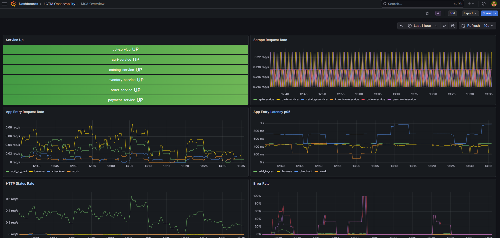

### 4.2 Logs Overview Dashboard

Logs Overview Dashboard는 Loki에 수집된 App VM K3S Pod 로그를 조회하기 위한 대시보드이다. `{job="k3s-pods", host="app-vm"}`와 같은 LogQL 쿼리를 기반으로 서비스별 로그와 로그 레벨을 확인할 수 있다. 로그에는 `trace_id`가 포함되므로 장애 발생 시 로그에서 trace로 이동하여 원인을 추적할 수 있다.

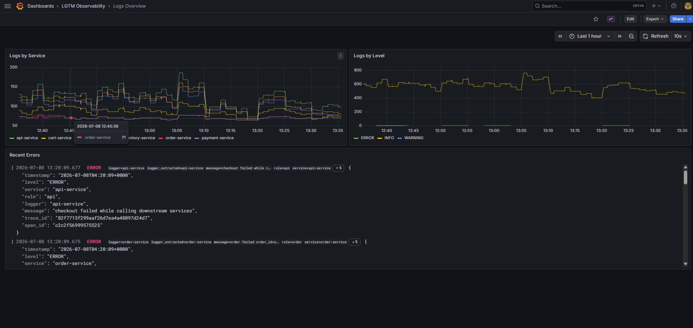

### 4.3 VM Metrics Dashboard

VM Metrics Dashboard는 Monitoring VM과 App VM의 CPU, memory, disk, network 지표를 확인하기 위한 대시보드이다. Node Exporter metric을 기반으로 각 VM의 시스템 리소스 상태를 비교할 수 있도록 구성하였다.

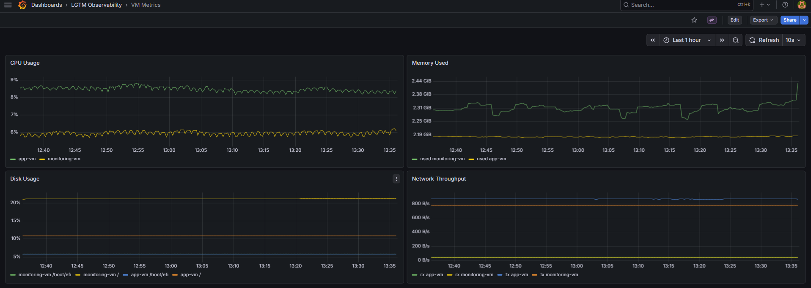

### 4.4 Traces Overview Dashboard

Traces Overview Dashboard는 Tempo에 저장된 MSA trace를 조회하기 위한 대시보드이다. `/browse`, `/cart/add`, `/checkout` 요청에서 발생하는 서비스 간 호출 흐름을 확인할 수 있다. 특히 checkout flow에서는 `api-service`, `cart-service`, `order-service`, `inventory-service`, `payment-service` 간의 호출 관계를 확인할 수 있다.

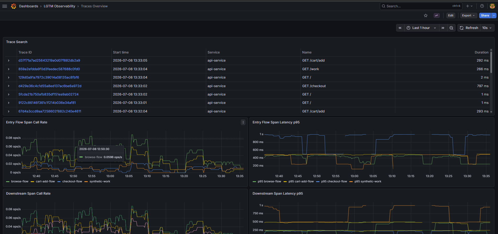

### 4.5 Alerts Overview Dashboard

Alerts Overview Dashboard는 App/MSA alert와 Monitoring backend alert의 현재 상태 및 이력을 확인하기 위한 대시보드이다. 현재 firing alert count는 instant query를 사용하여 현재 시점의 상태만 반영하도록 구성하였다. Timeline panel은 range query를 사용하여 과거 alert 이력을 확인할 수 있도록 분리하였다.

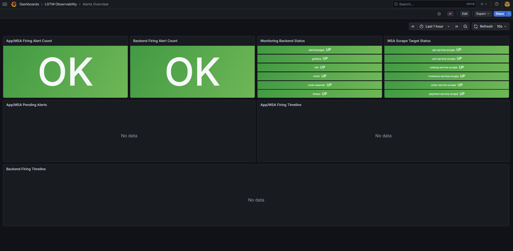

## 5. 검증 결과

### 5.1 Docker Compose 서비스 기동 확인

Monitoring VM에서 `docker compose up -d` 실행 후 `docker compose ps`를 통해 Grafana, Loki, Mimir, Tempo, Prometheus, Alertmanager, OTel Collector, MinIO, Node Exporter가 정상 실행 중임을 확인하였다.

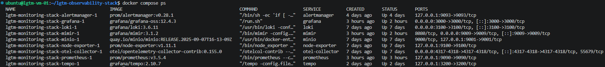

### 5.2 Grafana 데이터소스 연결 확인

Grafana에는 Loki, Mimir, Prometheus, Tempo datasource를 provisioning 방식으로 등록하였다. Loki datasource는 `http://loki:3100`, Mimir datasource는 `http://mimir:9009/prometheus`, Prometheus datasource는 `http://prometheus:9090`, Tempo datasource는 `http://tempo:3200`을 사용한다.

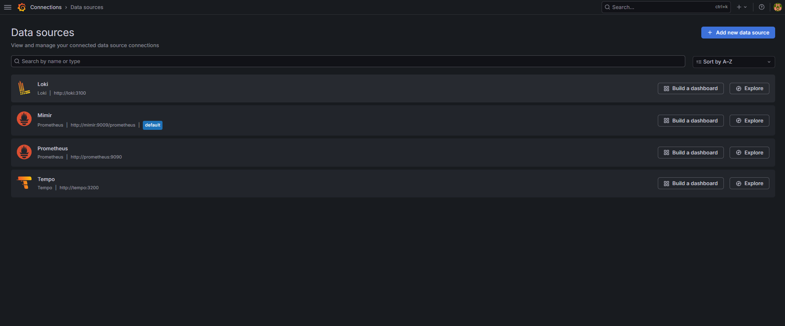

### 5.3 로그 수집 및 LogQL 조회 결과

로그에는 서비스명, 로그 레벨, logger, message, trace_id, span_id가 포함되어 있으며, 이를 통해 특정 요청의 로그와 trace를 연결할 수 있다.

- LokiQL 예시

```lokiql
{job="k3s-pods", host="app-vm"}
```

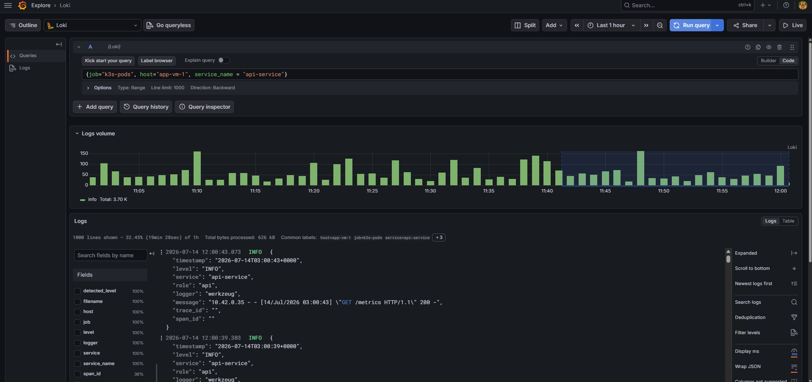

### 5.4 메트릭 수집 및 PromQL 조회 결과

Grafana의 Mimir datasource에서 `up` 쿼리를 실행하여 Monitoring VM과 App VM의 target 상태가 표시되는 것을 확인할 수 있다.

- PromQL 예시

```promql
up
sum by (service) (rate(demo_app_requests_total[5m]))
histogram_quantile(
  0.95,
  sum by (le, service) (rate(demo_app_request_duration_seconds_bucket{endpoint!="metrics"}[5m]))
)
```

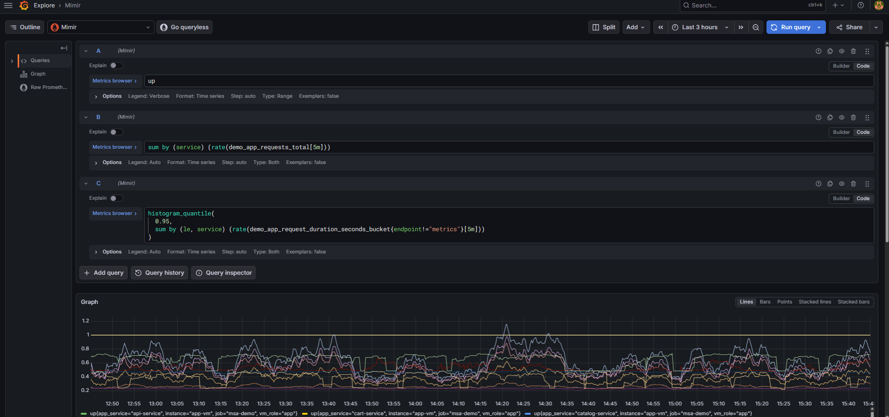

### 5.5 트레이스 수집 및 TraceQL 조회 결과

트레이스에는 서비스명, role, trace_id, span_id, parent_span_id, duration, status_code가 포함되어 있으며, 이를 통해 서비스 간 호출 관계와 요청 처리 시간을 확인할 수 있다.

- TraceQL 예시

```traceql
{ resource.service.name = "api-service" }
```

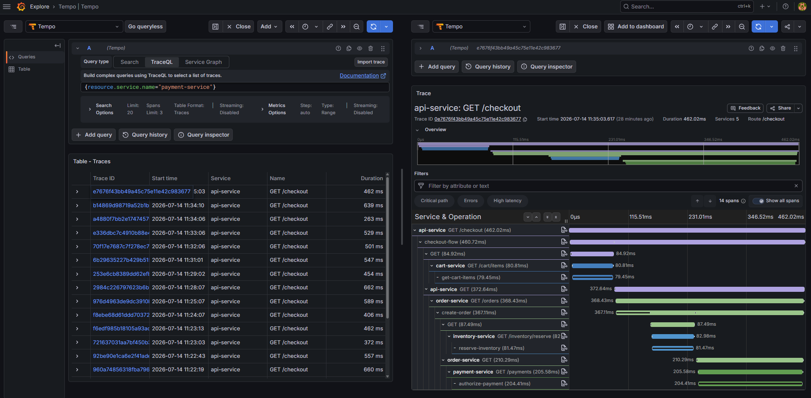

### 5.6 장애 주입 및 알림 발송 테스트 결과

장애 테스트는 App/MSA 장애와 Monitoring backend 장애로 나누어 수행하였다.

첫 번째 테스트는 `catalog-service`를 0 replica로 scale down하여 MSA 서비스 장애를 발생시키는 방식으로 진행하였다.

```bash
kubectl -n msa-demo scale deployment catalog-service --replicas=0
kubectl -n msa-demo scale deployment catalog-service --replicas=1
```

장애 발생 후 MSA Overview에서 `catalog-service`가 DOWN으로 표시되었고, Alerts Overview에서 `MsaServiceDown` alert가 firing 상태로 전환되었다. Slack에서도 firing 알림과 resolved 알림을 수신하였다.

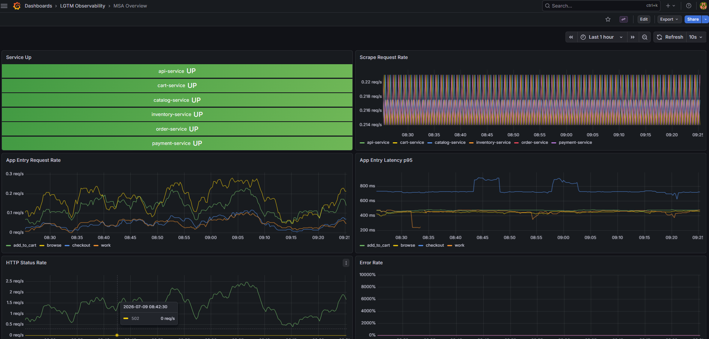

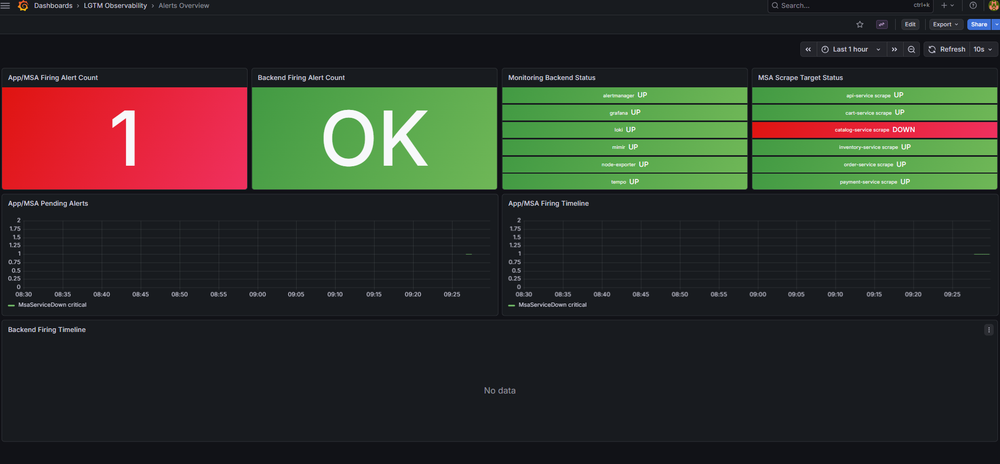

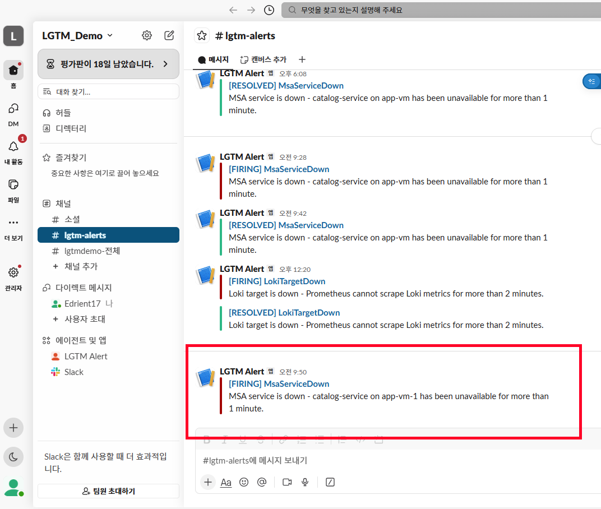

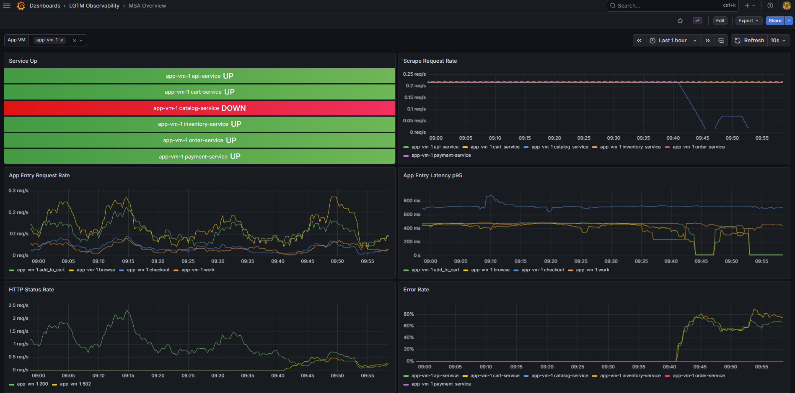

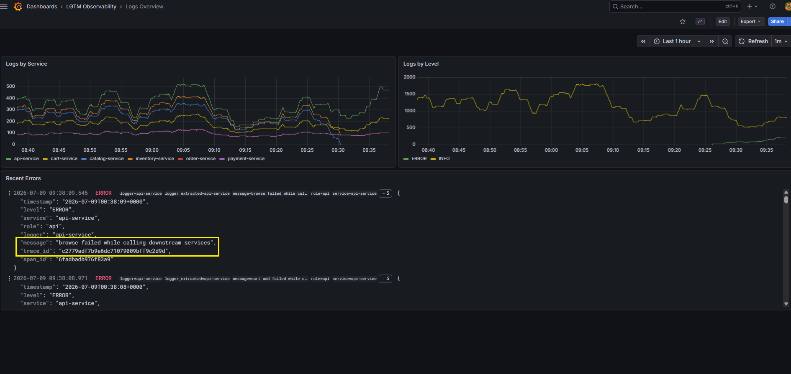

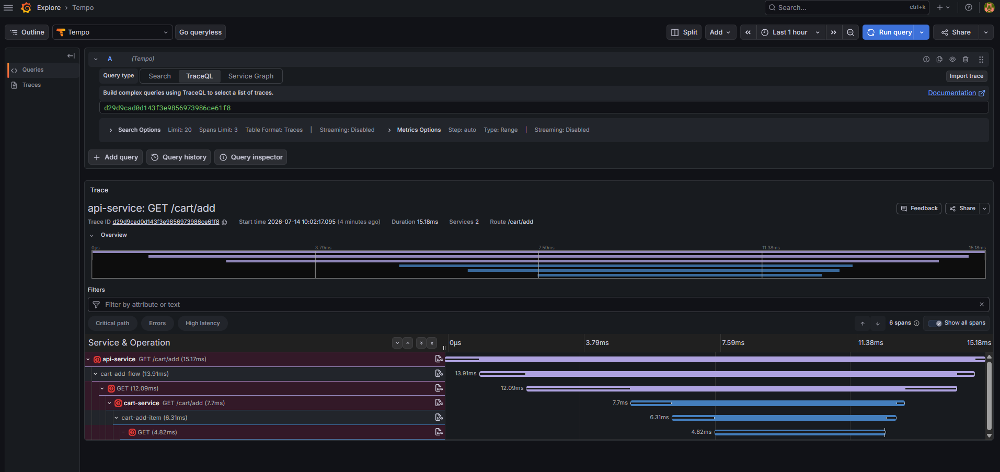

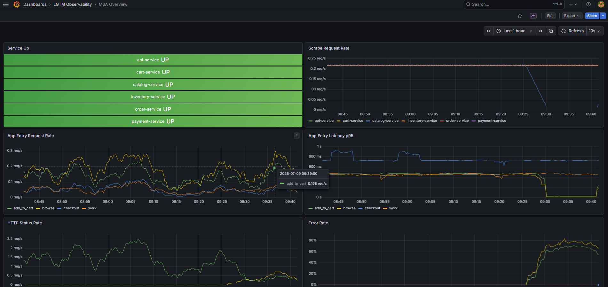

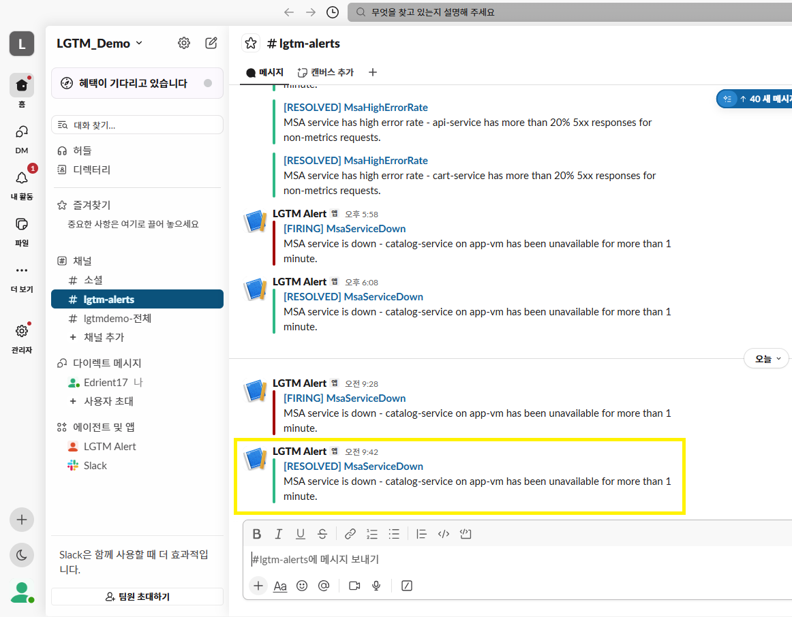

두 번째 테스트는 Monitoring backend 컴포넌트인 Loki를 중단하여 backend 장애 alert를 검증하는 방식으로 진행하였다.

```bash
docker compose stop loki
docker compose start loki
```

Loki 중단 후 Prometheus가 Loki target scrape에 실패하면서 `LokiTargetDown` alert가 firing 상태로 전환되었고, Alertmanager를 통해 Slack 알림을 수신하였다. Loki 복구 후 resolved 상태도 확인하였다.

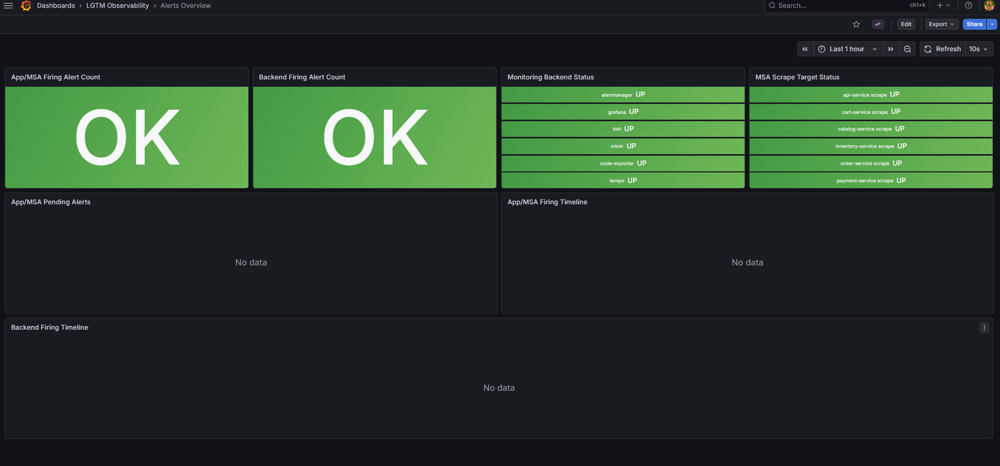

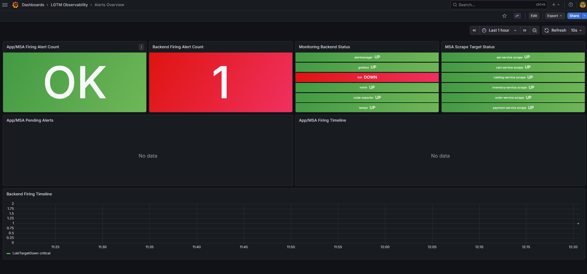

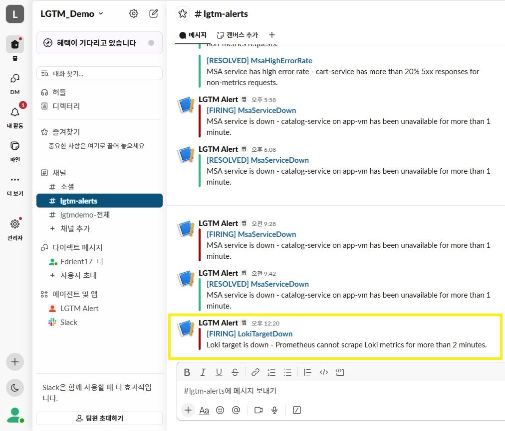

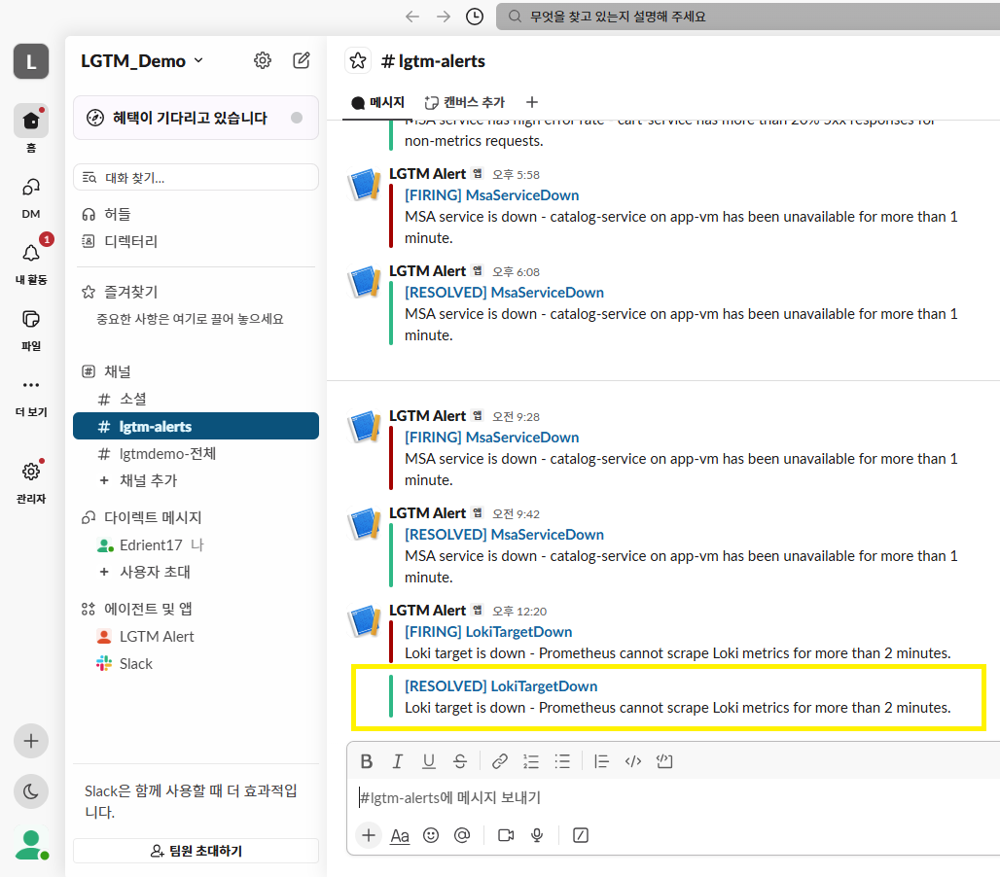

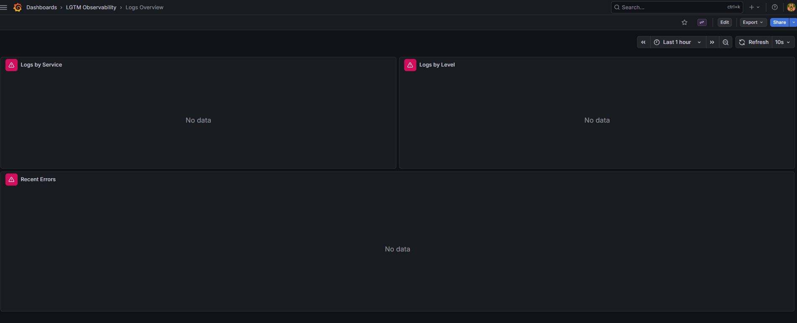

## 6. 트러블슈팅

### 6.1 Dashboard Has No Data 원인 및 해결

첫 번째 이슈는 Grafana dashboard는 정상적으로 열리지만 panel에 `No data`가 표시되는 문제였다.

이 문제는 크게 두 가지 원인으로 발생할 수 있었다. 첫째, App VM에서 실제 트래픽이 생성되지 않아 애플리케이션 metric이나 로그가 충분히 쌓이지 않은 경우이다. 둘째, Alloy가 Loki, Mimir, OTel Collector로 데이터를 정상 전송하지 못하는 경우이다.

해결을 위해 먼저 App VM에서 `scripts/random-demo-traffic.sh`를 실행하여 `/browse`, `/cart/add`, `/checkout`, `/work` 요청을 생성하였다. 이후 Grafana에서 `up` 쿼리와 `sum by (service) (rate(demo_app_requests_total[5m]))` 쿼리를 확인하였다.

또한 App VM에서 Alloy 로그를 확인하여 Loki, Mimir, OTel Collector 전송 오류가 있는지 점검하였다.

```bash
kubectl -n msa-demo logs daemonset/alloy --tail=100
```

마지막으로 `k3s/app-vm/configmap.yaml`의 `LOKI_PUSH_URL`, `MIMIR_REMOTE_WRITE_URL`, `ALLOY_OTLP_EXPORTER_ENDPOINT` 값이 Monitoring VM private IP를 가리키는지 확인하였다. 설정값을 수정한 뒤 K3S manifest를 다시 적용하여 문제를 해결하였다.

### 6.2 New App VM Is Running But Grafana Shows No App Metrics 원인 및 해결

두 번째 이슈는 App VM에서 K3S Pod, Service, DaemonSet은 정상 실행 중이고 각 서비스의 `/metrics` endpoint도 응답하지만, Grafana의 MSA Overview 또는 VM Metrics dashboard에서 App VM metric이 표시되지 않는 문제였다.

원인은 Alloy가 App VM 내부 target scrape에는 성공했지만, Monitoring VM의 Mimir `9009/tcp`로 remote_write하지 못하는 상태였다. 특히 Monitoring VM 보안그룹에서 `9009/tcp` inbound가 App VM private IP에 열려 있지 않거나, `MIMIR_REMOTE_WRITE_URL` 값이 잘못된 경우 이 문제가 발생할 수 있었다.

확인을 위해 App VM에서 Monitoring VM Mimir ready endpoint를 호출하였다.

```bash
curl http://<monitoring-vm-private-ip>:9009/ready
```

또한 Alloy 로그에서 remote_write 실패 메시지를 확인하였다.

```bash
kubectl -n msa-demo logs daemonset/alloy --tail=100
```

해결 방법은 Monitoring VM 보안그룹에서 App VM private IP를 source로 하는 `9009/tcp` inbound rule을 추가하고, `MIMIR_REMOTE_WRITE_URL` 값을 `http://<monitoring-vm-private-ip>:9009/api/v1/push`로 수정하는 것이었다. 이후 Mimir datasource에서 `up{job="msa-demo"}` 쿼리를 실행하여 App VM metric 수집 상태를 확인하였다.

### 6.3 Alert Count Panel Changes When Time Range Is Expanded 원인 및 해결

세 번째 이슈는 Grafana Alerts Overview에서 현재 장애가 없는데도 시간 범위를 `Last 90 days`처럼 길게 확장하면 firing alert count가 1 이상으로 표시되는 문제였다.

원인은 alert count stat panel이 현재 시점의 firing alert 개수를 보여야 하는데, panel query가 range query로 동작하면서 과거에 firing 되었던 `ALERTS{alertstate="firing"}` sample까지 reduce 계산에 포함되었기 때문이다. 이 경우 과거 장애 이력이 현재 firing count처럼 표시될 수 있다.

해결을 위해 현재 상태를 나타내는 App/MSA firing count와 Backend firing count panel은 instant query로 변경하였다.

```json
"instant": true,
"range": false
```

반면 과거 alert 이력을 보여주는 timeline panel은 range query를 유지하였다. 이를 통해 현재 상태와 과거 이력을 dashboard에서 명확히 분리할 수 있었다.

## 7. 회고 및 개선 제안

### 7.1 프로젝트를 통해 학습한 내용

이번 프로젝트를 통해 단일 컴포넌트 설치가 아니라 로그, 메트릭, 트레이스가 실제 애플리케이션에서 어떻게 생성되고 수집되며 저장되는지를 end-to-end로 이해할 수 있었다.

특히 Loki, Mimir, Tempo는 각각 저장하고 조회하는 데이터의 성격이 다르기 때문에 datasource 구성, query 언어, retention, storage 설정을 구분해서 이해해야 했다. 또한 Grafana dashboard를 구성할 때는 단순히 panel을 만드는 것뿐 아니라 현재 상태와 과거 이력, 서비스별 비교, 장애 시 원인 추적 흐름을 함께 고려해야 한다는 점을 확인하였다.

Promtail 기반 초기 구조에서 Alloy 기반 최종 구조로 개선하는 과정도 의미 있었다. Promtail은 로그 수집에는 적합하지만, App VM 단위에서 로그/메트릭/트레이스를 통합 관리하기에는 Alloy가 더 적합했다. Alloy를 사용하면서 수집 설정을 한 에이전트 안에서 관리하고, App VM의 service port를 외부에 공개하지 않는 구조로 바꿀 수 있었다.

### 7.2 현재 구성의 한계

현재 구성은 실습 및 소규모 검증 환경에 적합하지만, 운영 환경으로 확장하기 위해서는 몇 가지 한계가 있다.

첫째, K3S App VM이 단일 노드 구조이므로 고가용성을 제공하지 않는다. App VM 자체에 장애가 발생하면 MSA Demo App과 Alloy가 함께 영향을 받는다.

둘째, Monitoring VM도 단일 VM에 Grafana, Loki, Mimir, Tempo, Prometheus, Alertmanager, MinIO가 모두 실행되는 구조이다. 따라서 Monitoring VM 장애 시 전체 관측 시스템이 영향을 받을 수 있다.

셋째, MinIO는 단일 인스턴스로 구성되어 있어 object storage 고가용성이나 백업 정책이 충분하지 않다.

넷째, 인증과 권한 관리가 최소 수준으로 구성되어 있다. Grafana 로그인은 설정되어 있지만, Loki/Mimir/Tempo API는 내부 네트워크 기반 접근 제어에 의존한다.

다섯째, alert rule은 주요 장애 시나리오 중심으로 구성되어 있으며, 실제 운영 환경에서 필요한 SLO 기반 alert, error budget, 서비스별 임계치 조정은 추가 작업이 필요하다.

### 7.3 향후 개선 방향

향후 개선 방향은 다음과 같다.

첫째, Monitoring Stack을 고가용성 구조로 확장할 수 있다. Mimir, Loki, Tempo를 각각 distributed mode로 구성하고 object storage를 외부 managed storage로 전환하면 장애 허용성을 높일 수 있다.

둘째, Alloy 설정을 서비스 discovery 기반으로 개선할 수 있다. 현재는 MSA service target을 정적으로 지정하고 있으나, Kubernetes service discovery를 활용하면 서비스가 늘어나도 scrape 설정을 더 유연하게 관리할 수 있다.

셋째, alert rule을 SLO 중심으로 개선할 수 있다. 단순 target down, latency threshold뿐 아니라 request success rate, error budget burn rate, 서비스별 중요도 기반 alert routing을 적용할 수 있다.

넷째, dashboard를 운영자 관점으로 더 정리할 수 있다. 장애 발생 시 가장 먼저 봐야 할 overview, 서비스별 drill-down, 로그/트레이스 연계 화면을 구분하면 실제 장애 대응 시간이 줄어들 수 있다.

다섯째, CI/CD 또는 IaC 도구를 도입할 수 있다. Terraform, Ansible, GitHub Actions 등을 활용하면 VM 준비, Docker/K3S 설치, 설정 배포, 검증을 더 재현 가능하게 만들 수 있다.

## 부록 A. 주요 설정 파일 목록

| 경로 | 설명 |
| --- | --- |
| `docker-compose.yml` | Monitoring VM LGTM backend stack 실행 정의 |
| `.env.example` | Monitoring VM 환경변수 예시 |
| `configs/loki/loki-config.yaml` | Loki 설정 |
| `configs/mimir/mimir-config.yaml` | Mimir 설정 |
| `configs/tempo/tempo-config.yaml` | Tempo 설정 |
| `configs/prometheus/prometheus.yml` | Monitoring VM Prometheus scrape 및 remote_write 설정 |
| `configs/prometheus/rules/backend-alerts.yml` | Monitoring backend alert rule |
| `configs/mimir/rules/app-alerts.yml` | App/MSA alert rule |
| `configs/alertmanager/alertmanager.yml` | Alertmanager Slack routing 설정 |
| `configs/otel-collector/otel-collector-config.yaml` | OTel Collector trace pipeline 설정 |
| `grafana/provisioning/datasources/datasources.yaml` | Grafana datasource provisioning |
| `grafana/provisioning/dashboards/dashboards.yaml` | Grafana dashboard provisioning |
| `grafana/dashboards/*.json` | Grafana dashboard JSON export |
| `k3s/app-vm/msa-services.yaml` | MSA Demo App Deployment/Service manifest |
| `k3s/app-vm/alloy.yaml` | Alloy ConfigMap, Service, DaemonSet manifest |
| `k3s/app-vm/node-exporter.yaml` | App VM Node Exporter DaemonSet manifest |
| `k3s/app-vm/configmap.example.yaml` | App VM 환경변수 ConfigMap 예시 |
| `msa-demo/app.py` | MSA Demo App Flask 애플리케이션 |
| `scripts/healthcheck.sh` | Monitoring/App VM 검증 스크립트 |
| `scripts/random-demo-traffic.sh` | 데모 트래픽 생성 스크립트 |
| `scripts/k3s-fault-injection.sh` | 장애 주입 및 복구 스크립트 |

## 부록 B. 사용 버전 정보

| Component | Image | Version |
| --- | --- | --- |
| Grafana | `grafana/grafana-oss` | `12.4.3` |
| Loki | `grafana/loki` | `3.6.11` |
| Alloy | `grafana/alloy` | `v1.17.0` |
| Mimir | `grafana/mimir` | `3.1.2` |
| Tempo | `grafana/tempo` | `2.10.7` |
| Prometheus | `prom/prometheus` | `v3.5.4` |
| Alertmanager | `prom/alertmanager` | `v0.28.1` |
| Node Exporter | `prom/node-exporter` | `v1.11.1` |
| OpenTelemetry Collector Contrib | `otel/opentelemetry-collector-contrib` | `0.155.0` |
| MinIO | `quay.io/minio/minio` | `RELEASE.2025-09-07T16-13-09Z` |
| MinIO Client | `quay.io/minio/mc` | `RELEASE.2025-08-13T08-35-41Z` |
| Python base image | `python` | `3.12-slim` |

## 부록 C. 기술 조사 및 도입 판단

기술 조사 및 도입 판단 내용은 별도 문서로 분리하였다.

- 문서 위치: [technology-adoption-analysis.md](./technology-adoption-analysis.md)
